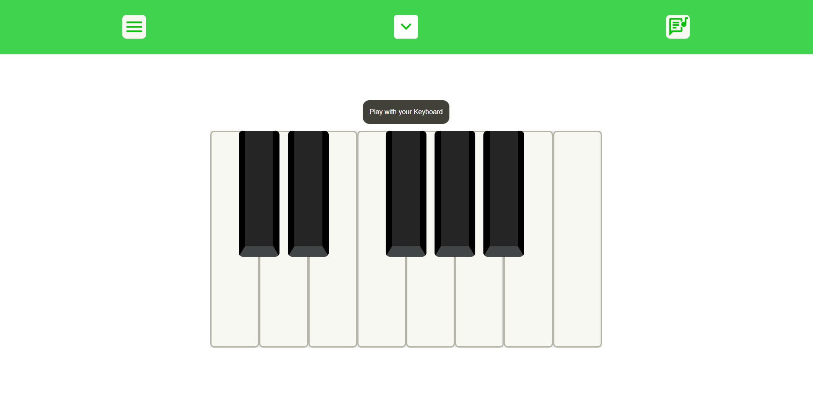
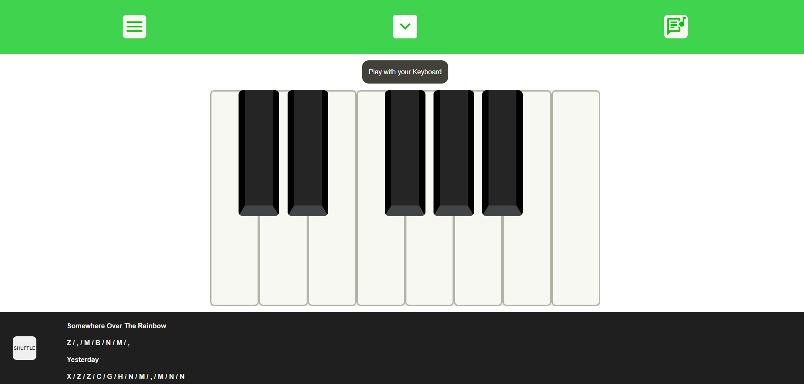

# Piano

<h1><a href="https://piano-online.vercel.app/">Visit Website</a></h1>

## Table of Contents
- [About](#about)
- [Screenshots](#screenshots)
- [Languages](#languages)
- [Code of Note](#code_of_note)
- [Bugs to fix](#bugs_to_fix)

---

## About 

An piano built in ReactJS which allows the user to choose between playing with a mouse or the keyboard. Each piano key is linked with a keypress. The user can also toggle an ideas bar which displays a list of popular melodies they can play with letters on their keyboard. This list can be shuffled.

---

## Screenshots 

A pop-up which has keyboard instructions for playing famous melodies, including a shuffle button to randomise a song.

---

## Languages 

- ReactJS
- SCSS

---

## Code of Note 

- use of a keyboard object to map keypresses to specific notes on the piano
- useSound()
- my first use of bootstrap
- toggle between inputs - keyboard and mouse

---

## Bugs to fix 

- Switching between playing with the mouse and keyboard causes the note played to gain in volume (not sure of fix right now)

